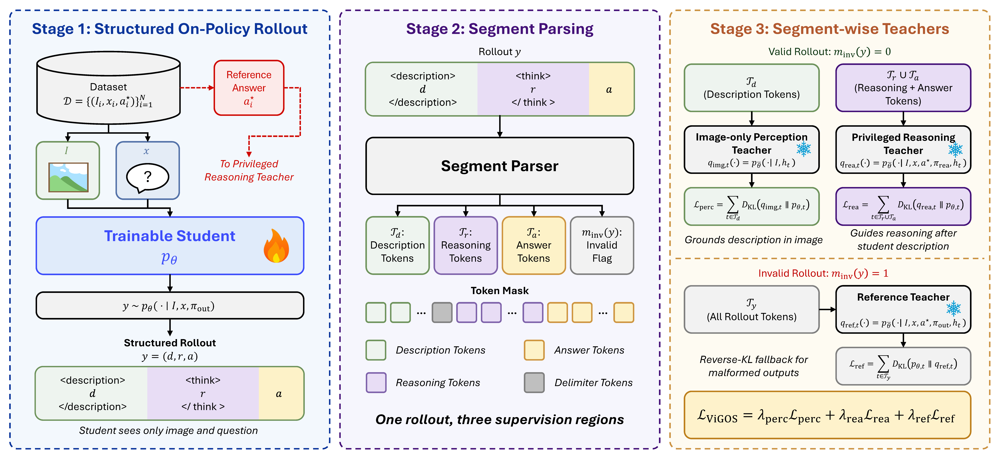

<div align="center">

# ViGOS

### Seeing Before Reasoning: Decoupling Perception and Reasoning for Shortcut-Resilient Multimodal On-Policy Self-Distillation

Sihan Wang<sup>1,2</sup>, Xiyao Liu<sup>1</sup>, Lianqing Liu<sup>1</sup>, Zhi Han<sup>1</sup>

<sup>1</sup>State Key Laboratory of Robotics and Intelligent Systems, Shenyang Institute of Automation, Chinese Academy of Sciences  
<sup>2</sup>University of Chinese Academy of Sciences

[](https://arxiv.org/pdf/2606.19120)
[](https://oedosoldier.github.io/ViGOS/)
[](https://github.com/OedoSoldier/ViGOS)
[](https://huggingface.co/OedoSoldier/ViGOS-3B)
[](https://huggingface.co/OedoSoldier/ViGOS-7B)

</div>

## Overview

ViGOS is a release-oriented training and evaluation package for visually grounded on-policy self-distillation of multimodal large language models. The released code supports LoRA post-training and evaluation for Qwen2.5-VL and Qwen3-VL style checkpoints. The paper experiments use Qwen2.5-VL-3B-Instruct and Qwen2.5-VL-7B-Instruct.

Vanilla multimodal OPSD can leak the privileged reference answer into dense token supervision before the student has grounded its response in the image. ViGOS changes the supervision path: the student first writes a visual description, then reasons, then gives a boxed final answer.

<p align="center">
  
</p>

## Contents

- [Released Checkpoints](#released-checkpoints)
- [Environment](#environment)
- [Data](#data)
- [Training](#training)
- [Evaluation](#evaluation)
- [Results](#results)
- [Project Page](#project-page)
- [Acknowledgements](#acknowledgements)
- [License](#license)
- [Citation](#citation)

## Released Checkpoints

HuggingFace model repositories are reserved at the following placeholders:

| Model | Download | Base model |
| --- | --- | --- |
| ViGOS-3B | [OedoSoldier/ViGOS-3B](https://huggingface.co/OedoSoldier/ViGOS-3B) | `Qwen/Qwen2.5-VL-3B-Instruct` |
| ViGOS-7B | [OedoSoldier/ViGOS-7B](https://huggingface.co/OedoSoldier/ViGOS-7B) | `Qwen/Qwen2.5-VL-7B-Instruct` |

Once public, the checkpoints can be used directly for evaluation:

```bash
MODEL_PATH=OedoSoldier/ViGOS-3B bash scripts/eval_vigos.sh
MODEL_PATH=OedoSoldier/ViGOS-7B bash scripts/eval_vigos.sh
```

Or downloaded locally:

```bash
huggingface-cli download OedoSoldier/ViGOS-3B --local-dir checkpoints/ViGOS-3B
huggingface-cli download OedoSoldier/ViGOS-7B --local-dir checkpoints/ViGOS-7B
```

## Method

The student output format is:

```text
<description> image description here </description>
<think> reasoning process here </think>
\boxed{FINAL ANSWER here}
```

ViGOS uses three teacher roles during training:

| Component | Context | Supervised tokens | Role |
| --- | --- | --- | --- |
| Perception teacher | image only | description span | Ground visual claims in the image. |
| Reasoning teacher | image, question, reference answer | reasoning + answer spans | Guide answer-conditioned reasoning after visual evidence exists. |
| Reference teacher | privileged full prompt | invalid rollout tokens only | Recover malformed output format with reverse KL. |

At inference time, all teachers and reference answers are discarded. The final model receives only the image, the question, and the ViGOS student prompt.

## Environment

```bash
git clone https://github.com/OedoSoldier/ViGOS.git
cd ViGOS
uv sync --python 3.11
```

The pinned environment includes PyTorch 2.8.0, Transformers 4.57.1, TRL 0.26.0, PEFT 0.17.1, Accelerate 1.11.0, DeepSpeed 0.18.2, and vLLM 0.11.0. Paper training used 8 NVIDIA A100 GPUs with bf16 and ZeRO-2.

If a HuggingFace dataset or model is gated:

```bash
uv run huggingface-cli login
```

## Data

Training uses the Vision-SR1-47K dataset on HuggingFace:

```bash
export DATASET_NAME=LMMs-Lab-Turtle/Vision-SR1-47K
export DATASET_SPLIT=train
```

Dataset link: [LMMs-Lab-Turtle/Vision-SR1-47K](https://huggingface.co/datasets/LMMs-Lab-Turtle/Vision-SR1-47K)

The HuggingFace dataset card reports the default subset with 47.6k training rows and Apache-2.0 license. The fields used by this release are:

| Field | Required | Description |
| --- | --- | --- |
| `problem` | yes | Question or instruction text. |
| `images` | yes | PIL-compatible image field. |
| `answer` | yes | Reference answer used by the default privileged teacher prompt. |
| `problem_id` | optional | Numeric id used for logging. |

Other dataset fields such as `solution`, `options`, `path`, and `data_source` may be present but are not required by the default shell scripts.

Tiny or invalid images can be filtered at load time:

```bash
FILTER_TINY_IMAGES=true MIN_IMAGE_SIZE=3 \
DATASET_NAME=LMMs-Lab-Turtle/Vision-SR1-47K \
bash scripts/train_vigos_qwen25_3b.sh
```

## Training

The shell launchers use Accelerate + DeepSpeed with `configs/accelerate_zero2_lora_gpu_8.yaml`.

Training curves and run logs are available in the [W&B Training Logs of ViGOS](https://wandb.ai/oedosoldier-ucas/ViGOS/reports/Training-Logs-of-ViGOS--VmlldzoxNzI0NzAzMg) report.

### Qwen2.5-VL-3B

```bash
DATASET_NAME=LMMs-Lab-Turtle/Vision-SR1-47K \
bash scripts/train_vigos_qwen25_3b.sh
```

### Qwen2.5-VL-7B

```bash
DATASET_NAME=LMMs-Lab-Turtle/Vision-SR1-47K \
bash scripts/train_vigos_qwen25_7b.sh
```

### Useful Overrides

```bash
DATASET_NAME=LMMs-Lab-Turtle/Vision-SR1-47K \
MAX_STEPS=500 \
SAVE_STEPS=100 \
REPORT_TO=none \
bash scripts/train_vigos_qwen25_3b.sh
```

### Default Training Configuration

| Parameter | ViGOS-3B | ViGOS-7B |
| --- | --- | --- |
| Base model | `Qwen/Qwen2.5-VL-3B-Instruct` | `Qwen/Qwen2.5-VL-7B-Instruct` |
| Epochs | 1 | 1 |
| GPUs/processes | 8 | 8 |
| Effective batch size | 32 | 32 |
| Per-device batch size | 2 | 1 |
| Gradient accumulation | 2 | 4 |
| Learning rate | `5e-6` | `5e-6` |
| Precision | bf16 | bf16 |
| Distributed training | ZeRO-2 | ZeRO-2 |
| Max prompt length | 32768 | 32768 |
| Max completion length | 4096 | 4096 |
| Rollout sampling | temp 1.1, top-p 0.95, top-k 20 | temp 1.1, top-p 0.95, top-k 20 |
| LoRA | r 64, alpha 128, dropout 0.05 | r 64, alpha 128, dropout 0.05 |
| Loss weights | `lambda_perception=1.0`, `lambda_reasoning=1.0`, `lambda_ref=2.0` | same |
| KL token clip | 0.05 | 0.05 |
| vLLM tensor parallel size | 1 | 2 |
| vLLM GPU memory utilization | 0.45 | 0.40 |

Training saves PEFT LoRA adapters under `runs/`. Merge an adapter into the base model before standalone evaluation:

```bash
uv run python scripts/merge_lora.py \
  --adapter runs/vigos_qwen25_3b_YYYYMMDD-HHMMSS/checkpoint-500 \
  --output runs/vigos_qwen25_3b_merged \
  --overwrite
```

If `--base-model` is omitted, the merge script reads `base_model_name_or_path` from the adapter config.

## Evaluation

Evaluation uses the ViGOS student prompt with assistant-side `<description>` prefill. The default wrapper uses vLLM for generation and an OpenAI-compatible judge when judging is enabled.

```bash
export DEEPSEEK_API_KEY=your_api_key

MODEL_PATH=runs/vigos_qwen25_3b_merged \
bash scripts/eval_vigos.sh
```

| Setting | Default |
| --- | --- |
| `PASS_K` | 5 |
| `BATCH_SIZE` | 8 generated candidates per vLLM call |
| `MAX_TOKENS` | 4096 |
| Sampling | temp 1.0, top-p 0.9, top-k 50 |
| Judge model | `deepseek-v4-flash` |
| Judge API URL | `https://api.deepseek.com` |
| Judge key env | `DEEPSEEK_API_KEY` |
| Dataset suite | `mm-vet`, `mmmu_pro_10options`, `mmmu-pro-vision`, `MMMU`, `MMSI`, `mathverse`, `mathvista`, `realWorldQA` |
| Benchmark suite | `vilp-f`, `vilp-p` |

Include CV-Bench:

```bash
MODEL_PATH=runs/vigos_qwen25_3b_merged \
EVAL_BENCHMARKS=vilp-f,vilp-p,cv-bench \
bash scripts/eval_vigos.sh
```

Generate responses without judging:

```bash
MODEL_PATH=runs/vigos_qwen25_3b_merged \
SKIP_JUDGE=true \
bash scripts/eval_vigos.sh
```

Outputs are written under `eval_outputs/vigos_${RUN_ID}/`:

| Path | Content |
| --- | --- |
| `responses/*.jsonl` | Prompts, sampled responses, extracted answers. |
| `judgments/*.jsonl` | Compact judge records with pass@k and avg@k verdicts. |
| `benchmark_scores/*.json` | Benchmark-specific summaries. |
| `summary.json` | Run configuration and aggregate output paths. |

## Results

Pass@5 counts an example correct if any of five samples is correct. Avg@5 averages correctness across the five samples.

### Main Benchmark Averages

| Backbone | Model | Mean Pass@5 | Mean Avg@5 |
| --- | --- | ---: | ---: |
| Qwen2.5-VL 3B | Baseline | 60.86 | 27.91 |
| Qwen2.5-VL 3B | OPSD | 72.08 | 41.13 |
| Qwen2.5-VL 3B | **ViGOS** | **71.97** | **41.35** |
| Qwen2.5-VL 7B | Baseline | 68.13 | 45.38 |
| Qwen2.5-VL 7B | OPSD | 74.11 | 51.12 |
| Qwen2.5-VL 7B | **ViGOS** | **75.60** | **50.99** |

### ViLP Prior-Sensitive Results

Higher Score indicates better image-grounded reasoning under prior conflict. Higher Prior indicates retained prior-aligned knowledge.

| Model | ViLP-F Score | ViLP-F Prior | ViLP-P Score | ViLP-P Prior |
| --- | ---: | ---: | ---: | ---: |
| Visionary-R1-3B | 64.67 | 94.67 | 65.17 | 88.00 |
| Vision-R1-7B | 57.17 | 95.67 | 57.83 | 90.00 |
| Baseline 3B | 59.50 | 93.33 | 55.67 | 80.67 |
| OPSD 3B | 67.17 | 97.33 | 66.83 | 92.00 |
| **ViGOS 3B** | **70.17** | **97.67** | **69.50** | **90.00** |
| Baseline 7B | 42.00 | 73.33 | 37.00 | 58.67 |
| OPSD 7B | 58.00 | 97.67 | 57.00 | 91.67 |
| **ViGOS 7B** | **62.67** | **97.00** | **61.67** | **91.67** |

<details>
<summary><b>Full eight-benchmark table</b></summary>

All values are percentages and formatted as Pass@5 / Avg@5.

| Model | MM-Vet | MMMU | MMMU-Pro | MathVerse | MathVista | MMSI | RealWorldQA | CV-Bench |
| --- | --- | --- | --- | --- | --- | --- | --- | --- |
| Visionary-R1-3B | 64.22 / 49.27 | 70.28 / 43.49 | 52.71 / 27.10 | 55.71 / 33.76 | 72.00 / 57.18 | 58.50 / 25.18 | 82.88 / 57.67 | 88.25 / 70.33 |
| Vision-R1-7B | 73.39 / 59.54 | 64.69 / 47.58 | 47.29 / 31.48 | 63.71 / 47.48 | 77.30 / 63.92 | 40.50 / 24.64 | 75.42 / 66.95 | 83.47 / 74.81 |
| Baseline 3B | 62.39 / 34.68 | 71.51 / 33.54 | 55.00 / 22.55 | 60.61 / 30.18 | 65.40 / 35.08 | 53.20 / 16.78 | 38.17 / 15.76 | 80.59 / 34.68 |
| OPSD 3B | 68.81 / 45.69 | 76.42 / 42.70 | 57.04 / 26.24 | 59.54 / 30.45 | 72.80 / 43.84 | 63.60 / 23.68 | 86.93 / 53.02 | 91.47 / 63.43 |
| **ViGOS 3B** | **65.60 / 43.76** | **76.42 / 42.32** | **56.44 / 26.16** | **58.55 / 30.10** | **74.00 / 43.50** | **66.40 / 24.90** | **86.80 / 55.37** | **91.51 / 64.67** |
| Baseline 7B | 69.72 / 52.94 | 77.77 / 50.30 | 63.85 / 37.41 | 68.40 / 45.63 | 79.20 / 60.90 | 63.20 / 27.10 | 32.55 / 12.94 | 90.37 / 75.85 |
| OPSD 7B | 70.18 / 52.75 | 77.99 / 50.99 | 63.37 / 36.91 | 68.65 / 45.57 | 80.50 / 61.54 | 60.30 / 25.68 | 85.62 / 61.20 | 90.26 / 74.32 |
| **ViGOS 7B** | **72.02 / 54.40** | **80.11 / 51.42** | **64.81 / 36.48** | **68.91 / 44.77** | **80.90 / 58.78** | **61.10 / 25.58** | **85.88 / 62.88** | **91.09 / 73.58** |

</details>

## Project Page

The static GitHub project page lives under `docs/` and can be deployed through GitHub Pages by selecting the repository branch and `/docs` folder.

```text
docs/
+-- index.html
+-- static/
    +-- css/
    +-- images/
    +-- js/
```

## Acknowledgements

We thank the authors and maintainers of [zli12321/Vision-SR1](https://github.com/zli12321/Vision-SR1) for the Vision-SR1 project and training data foundation. This release also builds on Qwen2.5-VL/Qwen3-VL model support, vLLM, Transformers, TRL, PEFT, Accelerate, DeepSpeed, and the benchmark suites used in the paper: MM-Vet, MMMU, MMMU-Pro, MathVerse, MathVista, MMSI, RealWorldQA, CV-Bench, and ViLP.

The project page is adapted from the Academic Project Page Template, which credits the Nerfies project page.

## License

The ViGOS implementation code, including source files and configuration or launcher files under `vigos/`, `scripts/`, and `configs/`, is released under the [Apache License 2.0](LICENSE), unless otherwise noted. See [NOTICE](NOTICE) for scope and attribution notes.

The ViGOS paper, paper PDF, paper text, paper figures, and project-page research content are released under the [Creative Commons Attribution-NonCommercial-NoDerivatives 4.0 International License](LICENSE-PAPER.md) (CC BY-NC-ND 4.0), unless otherwise noted.

Model weights, third-party datasets, benchmark assets, external dependencies, and the project-page template are subject to their own licenses. The project-page template license is documented in [docs/README.md](docs/README.md).

## Citation

```bibtex
@misc{wang2026seeing,
  title={Seeing Before Reasoning: Decoupling Perception and Reasoning for Shortcut-Resilient Multimodal On-Policy Self-Distillation},
  author={Wang, Sihan and Liu, Xiyao and Liu, Lianqing and Han, Zhi},
  year={2026},
  eprint={2606.19120},
  archivePrefix={arXiv},
  primaryClass={cs.LG},
  url={https://arxiv.org/abs/2606.19120}
}
```
